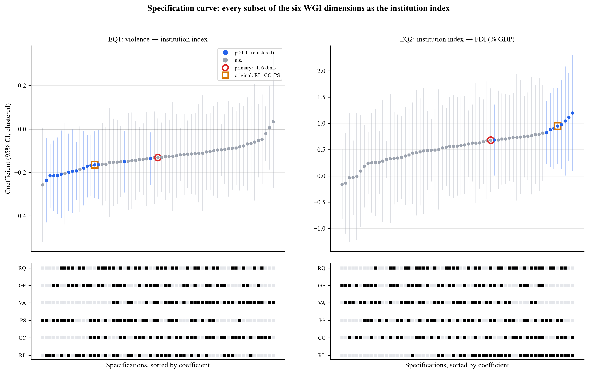
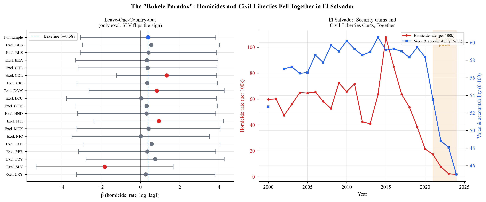
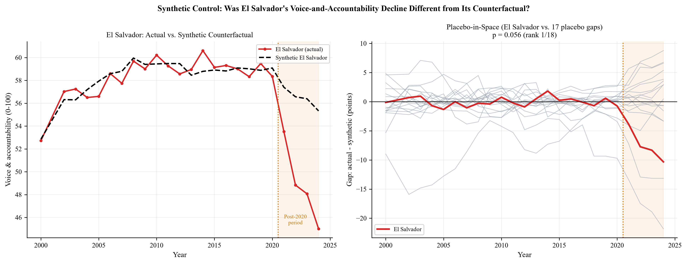
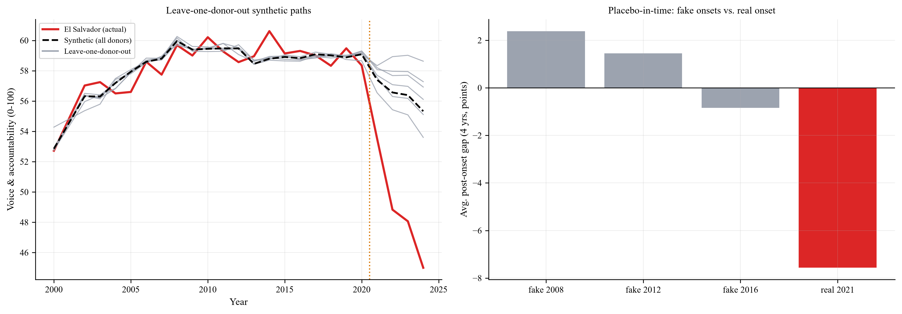

# Violence, Institutions, and Growth in Latin America and the Caribbean

## Abstract

This repository implements an empirical research workflow for studying how violent crime affects institutional quality and, through that channel, economic growth. The project combines a structured panel-data econometric pipeline with machine-learning triangulation to examine whether the relationship between homicide exposure and growth is direct or mediated by institutional quality and foreign direct investment. The core analysis focuses on a panel of 18 Latin American and Caribbean countries — the original 11 (Central America, Colombia, the Dominican Republic, Mexico, Ecuador and Peru) plus the Bahamas, Belize, Brazil, Chile, Haiti, Paraguay and Uruguay (added October 2026 under an ex-ante coverage rule; see Second Panel Extension below) — over the period 2000–2024 (447 country-year observations). The empirical strategy is designed to be transparent, reproducible, and suitable for academic review. The repository therefore emphasizes clear data preparation, robust inference, and documented estimation steps rather than ad hoc exploratory analysis.

## Research Question

How does violence, measured by homicide rates, affect institutional quality and subsequent economic performance, and is the relationship between crime and growth mediated by institutions and foreign direct investment?

## Methodology Overview

The project uses a longitudinal panel-data design with country and year effects. The baseline specification is a pooled OLS benchmark, followed by two-way fixed-effects models that absorb time-invariant country heterogeneity and common shocks. Inference is reported with conventional clustered standard errors and with more conservative robust alternatives, including Driscoll-Kraay standard errors to account for cross-sectional dependence, a CR2 (Bell-McCaffrey) bias-corrected estimator with Satterthwaite degrees of freedom, and wild cluster bootstrap inference for small-cluster panels. Because the three-equation chain (violence → institutions → FDI → growth) is estimated as separate single-equation models to avoid a generated-regressors problem, the hypothesized mechanism is additionally tested as a system: a country-cluster bootstrap of the product of the three path coefficients provides a formal test of the indirect effect, rather than relying on each link's significance in isolation. Robustness checks include leave-one-country-out re-estimation, alternative lag structures for every link in the chain (not only violence → institutions), a post-treatment ("bad control") check, country-specific linear trends, and a Fisher-ADF panel unit-root test. In addition, a principal component analysis is used to construct a summary institutional index from the World Governance Indicators, and machine-learning methods are used as an exploratory triangulation layer rather than as a substitute for causal estimation, with a leakage-free (fold-safe) reconstruction of the institution index under Leave-One-Country-Out cross-validation. Finally, an exploratory quantile-regression finding — that violence caps the upper tail of GDP growth without shifting its median — is re-estimated as a hierarchical Bayesian model (MCMC, Asymmetric Laplace likelihood) with partial pooling across countries, reported with full posterior uncertainty rather than asymptotic quantile-regression standard errors.

## Pipeline Architecture

The main entry point of the repository is the econometric pipeline under [econometric_pipeline/pipeline](econometric_pipeline/pipeline). This is the core reproducible system. All steps below are executed through the master runner in [econometric_pipeline/pipeline/run_pipeline.py](econometric_pipeline/pipeline/run_pipeline.py).

The workflow proceeds in twelve stages:

1. Data loading: the pipeline reads a clean panel dataset containing country-year observations.
2. Cleaning and ETL: the data are validated, missingness is assessed, and institutional variables are standardized and combined into an index.
3. Feature engineering: the panel is enriched with time trends, lagged violence variables, and derived institutional measures.
4. PCA construction: a robustness institutional index is created using principal component analysis on the governance indicators.
5. Econometric estimation: two-way fixed-effects models estimate the violence-to-institutions, institutions-to-FDI, and FDI-to-growth relationships, each also re-estimated under a one-year-lag alternative.
6. Machine-learning triangulation: random forest and gradient boosting models are trained for exploratory comparison with the econometric estimates, using leave-one-country-out cross-validation with a fold-safe institution index.
7. Validation: diagnostics, bootstrap inference (including a cluster bootstrap of the full mediation chain's indirect effect), and robustness checks assess sensitivity to influential observations, lag choices, control-set choices, country-specific trends, non-stationarity, and model specification.
8. Panel cointegration & error-correction: for the pairs of variables found non-stationary in stage 7 (homicide rate, institutions, GDP per capita), a two-step Engle-Granger/Kao residual-based test checks whether they share a genuine long-run equilibrium before estimating an error-correction model; if not, this is reported as a finding in its own right rather than silently assumed away.
9. Growth-Ceiling-at-Risk (Bayesian MCMC): a hierarchical Bayesian quantile regression (Asymmetric Laplace likelihood, partial pooling across countries) re-estimates an exploratory finding that violence caps the upper tail of GDP growth without affecting its median, replacing LSDV country dummies and asymptotic quantile-regression inference with partial-pooling regularization and full posterior uncertainty.
10. Synthetic control: a "synthetic El Salvador" built from the other countries estimates the counterfactual voice-and-accountability path absent the post-2020 political-institutional shift, with placebo-in-space inference and robustness checks (leave-one-donor-out, placebo-in-time, a 2022 onset).
11. Conditional-heteroskedasticity diagnostic: Engle's ARCH-LM test per country, to check whether a GARCH-type volatility model would have anything to estimate.
12. Specification curve: EQ1 and EQ2 are re-estimated for every one of the 63 subsets of the six WGI dimensions used as the institution index, showing how much the conclusions depend on that choice.

## Repository Structure

```text
data_analyzer/
├── econometric_pipeline/
│   └── pipeline/
│       ├── 01_data_preparation.py
│       ├── 02_panel_estimation.py
│       ├── 03_diagnostics.py
│       ├── 04_bootstrap_inference.py
│       ├── 05_robustness.py
│       ├── 06_ml_triangulation.py
│       ├── 07_cointegration.py
│       ├── 08_growth_ceiling_risk.py
│       ├── 09_synthetic_control.py
│       ├── 10_arch_lm_test.py
│       ├── 11_spec_curve.py
│       ├── run_pipeline.py
│       ├── utils.py
│       ├── research_report.py
│       ├── figures/
│       ├── json/
│       ├── tables/
│       └── README.md
├── tests/                   # pytest suite (data invariants, output consistency, doc/number drift)
├── archive/
│   ├── legacy_scripts/
│   └── legacy_data/
├── data_extraction/
├── documentation/
├── foundational_datasets/
├── requirements.txt
└── README.md
```

## How to Run the Project

### 1. Environment setup

```bash
python -m venv .venv
source .venv/bin/activate   # Linux/macOS
.venv\Scripts\activate      # Windows PowerShell
pip install -r requirements.txt
```

### 2. Run the main pipeline

From the repository root:

```bash
python econometric_pipeline/pipeline/run_pipeline.py
```

Optional arguments include:

```bash
python econometric_pipeline/pipeline/run_pipeline.py --skip 4 5
python econometric_pipeline/pipeline/run_pipeline.py --data econometric_pipeline/pipeline/panel_ready_for_modeling.csv
```

### 3. Expected outputs

The pipeline generates:

- figures in [econometric_pipeline/pipeline/figures](econometric_pipeline/pipeline/figures), including the mediation bootstrap distribution (`06b_mediation_bootstrap.png`)
- tables in [econometric_pipeline/pipeline/tables](econometric_pipeline/pipeline/tables), including `se_comparison.tex` (standard-error sensitivity table, paste-ready for a manuscript)
- JSON summaries in [econometric_pipeline/pipeline/json](econometric_pipeline/pipeline/json), including `04_mediation.json` (indirect-effect bootstrap results)
- a final report PDF at [econometric_pipeline/pipeline/econometric_report.pdf](econometric_pipeline/pipeline/econometric_report.pdf)

### 4. Run the tests

```bash
pip install -r requirements-dev.txt
pytest
```

The tests (in [tests](tests)) check panel-data invariants, internal consistency of the pipeline's JSON outputs (e.g. synthetic-control weights sum to 1, the randomization p-value equals rank/N), and that the headline numbers quoted in the READMEs still match the pipeline outputs. They run in under a second and do not re-run the pipeline.

## Data Sources

The empirical analysis draws on the following sources:

- World Bank World Development Indicators (WDI): macroeconomic and development indicators
- World Governance Indicators (WGI): all six Kaufmann et al. (2010) dimensions — rule of law, control of corruption, political stability, voice and accountability, government effectiveness, and regulatory quality
- World Bank remittances data (personal remittances received, % of GDP): tested as a robustness control, not part of the primary specification (see Institution Index Expansion below)
- UNODC / crime statistics: homicide indicators
- Processed datasets used by the pipeline: the prepared panel input and the pipeline-generated intermediate files in [econometric_pipeline/pipeline](econometric_pipeline/pipeline)

## Data Provenance Fixes (September 2026)

A follow-up audit of the data-extraction chain (`data_extraction/`, `archive/legacy_scripts/`) — prompted by a hunch that mixed variable scales might be causing trouble — found the scales themselves were fine (mixing 0-100 percentiles, % GDP and logs in one regression doesn't bias FE/OLS or tree-based ML), but surfaced four real data bugs upstream of the pipeline described above:

1. **`homicide_rate` was silently winsorized at the 1st/99th percentile** before the log transform (`archive/legacy_scripts/build_master_dataset.py`). With 179 observations, the 4 clipped points were all El Salvador: its 2015/2016 violence peak (107.6 → 83.6, 85.1 → 83.6) and its 2023/2024 post-reform lows (2.24 → 5.43, 1.90 → 5.43) — exactly the abrupt security shift this project studies, flattened before it ever reached EQ1, and undocumented anywhere. Removed.
2. **`trade_percent_gdp` was 100% empty** across every observation, because it was computed as `exports_percent_gdp + imports_percent_gdp` but `imports_percent_gdp` was never extracted. This explains why "Extended controls" always failed in Module 05's robustness checks. Fixed by adding the missing World Bank indicator (`NE.IMP.GNFS.ZS`).
3. **`gdp_per_capita` mixed nominal (current US$) and real (constant 2015 US$) values for Guatemala specifically** — a gap-filling script pulled the wrong indicator for that one country, contaminating the within-country variation of a control used in every equation. Fixed to use the same indicator as the other seven countries.
4. **The only live WGI-extraction script pulled the wrong governance scale** (the "-2.5 to 2.5" estimate instead of the "0-100" score every module documents and expects) — dead code, since the pipeline actually sourced institutions from a manually-downloaded file that was never committed to the repo and whose exact vintage could not be verified. Fixed the indicator codes and pointed the merge step at the corrected live script instead, closing the reproducibility gap.

The panel is now balanced at the country-year level (200 rows = 8 × 25, up from 179 — the old chain dropped an entire row whenever *any* one source had a gap; individual variables still have their own genuine missing values, unchanged and still handled by `dropna()` downstream). Re-running the full pipeline on the corrected data leaves EQ1, EQ3 and the mediation test's conclusions unchanged, but **EQ2 (institutions → FDI) becomes substantially more robust**: p = 0.055 / 0.116 / 0.202 / 0.062 (clustered / Driscoll-Kraay / CR2 / wild bootstrap) under the old data → **p = 0.007 / 0.085 / 0.126 / 0.012** under the corrected data. See the commit range `0a750fe`..`c98978c` for the full detail, including a fifth, unrelated bug this surfaced in Module 06 (an unmasked-target array-alignment issue that only showed up once the panel stopped being artificially pre-filtered by the old buggy joins).

## Methodological Review (September 2026)

A methodological review of the pipeline — aimed at academic-level scrutiny (arXiv / university presentation) — identified and fixed several issues common to small-N panel studies. The full technical detail lives in each module's docstring and in the commit history from `79a37a6` to `7563671`; the summary here is meant to save a reviewer from re-deriving it:

1. **Standard-error sensitivity is now reported instead of the most favorable single number.** The institutions → FDI coefficient (EQ2) looks "marginally significant" (p ≈ 0.055) only under conventional clustered SEs — the least conservative of the four estimators this pipeline computes, and known to over-reject with G=8 clusters. Under Driscoll-Kraay (p ≈ 0.12) and CR2 Bell-McCaffrey (p ≈ 0.20) it is not significant at 10%; the wild cluster bootstrap gives p ≈ 0.06. See `tables/se_comparison.tex` and Section 11 of the PDF report.
2. **The full transmission chain is now formally tested, not just narrated.** Module 04 bootstraps the product of the three path coefficients (β₁·γ₁·δ₁) by resampling countries. Point estimate: −0.017, 95% CI [−0.079, 0.065], p = 0.62 — the chain as a system is not distinguishable from zero, even though each link's sign matches the theory.
3. **Lag structure is now tested for EQ2 and EQ3, not only EQ1.** The theoretical model argues institutions and growth adjust more slowly than violence, but the primary EQ2/EQ3 specifications used contemporaneous regressors. Re-estimating with one-year lags (Module 05) flips EQ3's sign (+0.137 contemporaneous vs. −0.121 lagged).
4. **A post-treatment ("bad control") check was added.** `gdp_per_capita_log` is plausibly downstream of institutions/FDI, not an exogenous confounder; excluding it moves EQ2's coefficient from 0.900 (p=0.055) to 0.739 (p=0.128).
5. **Country-specific linear trends and a panel unit-root test (Fisher-ADF / Maddala-Wu) were added.** Two-way FE does not remove country-specific trends, and `homicide_rate_log`, `inst_avg` and `gdp_per_capita_log` fail to reject a unit root over this 25-year panel — consistent with EQ1 (violence → institutions) being the least stable link across every check in this pipeline.
6. **Leave-One-Country-Out cross-validation no longer leaks the held-out country into the institution index.** `inst_avg` is rebuilt inside each fold from the training countries' scaling constants only.
7. **A silent bug in the FE-vs-ML convergence table was fixed** — it always printed "?" because of an incorrect JSON key lookup for EQ3's coefficients.

## Panel Extension (September 2026)

*(Historical record of the 8 → 11 step. The panel has since been extended again to 18 countries and the significance pattern changed; see Second Panel Extension below for the current results.)*

Every G=8-related caveat elsewhere in this README speculated that the small number of countries was the binding statistical constraint on this project's results. That hypothesis is now directly testable: Mexico, Ecuador and Peru were added to the panel (11 countries, 274 country-year rows, up from 200), specifically including Mexico for its regional weight in security dynamics (cartel-related violence). The same extraction scripts were reused unchanged in logic — only the country list grew — confirming the data pipeline built during the provenance-fix pass generalizes cleanly.

The effect on results was dramatic, in the direction the small-G caveats predicted:

| | EQ1 (violence→institutions) | EQ2 (institutions→FDI) | EQ3 (FDI→growth) |
|---|---|---|---|
| p (clustered), 8 → 11 countries | 0.352 → **0.093*** | 0.007 → **0.0005*** | 0.306 → **0.010*** |
| p (Driscoll-Kraay) | 0.417 → **0.010*** | 0.085 → **0.003*** | — |
| p (wild cluster bootstrap) | 0.290 → **0.085*** | 0.012 → **0.002*** | 0.450 → 0.108 |

The mediation bootstrap of the full chain's indirect effect moved from a point estimate of -0.0075 (95% CI [-0.069, 0.051], p=0.65) to -0.031 (95% CI [-0.137, 0.015], p=0.144) — the CI still includes zero, but the chain is markedly closer to a formal system-level significance than it was at N=8. Module 07's cointegration test also changed qualitatively: the homicide-rate/GDP-per-capita pair (T3) now shows evidence of cointegration (Fisher-ADF on residuals, p=0.011) where it did not before, and the resulting error-correction model finds a significant speed of adjustment (phi=-0.109, p<0.01): GDP per capita corrects about 11% of any deviation from its long-run relationship with violence each year — the first dynamic (not merely static) causal-adjustment result in this project.

## Second Panel Extension: 11 → 18 Countries (October 2026)

The September extension (8 → 11 countries) moved the results a great deal, and every small-G caveat in this README named the number of countries as the binding constraint. So the panel was extended again, this time under a coverage rule fixed *before* looking at any estimate. The World Bank APIs were queried for all 42 economies in the Latin America & Caribbean region, and a country was added if it had: a homicide rate in at least 15 of the 25 years; each of the six WGI dimensions in at least 20 of the 24 available years; each of six core WDI series (GDP growth, GDP per capita, FDI, inflation, exports, population) in at least 20 years; and unemployment in at least 15 years. The 11 original countries were kept regardless, for continuity with everything reported before (Peru would fail the homicide threshold, with 11 observed years). Seven countries passed: **the Bahamas, Belize, Brazil, Chile, Haiti, Paraguay and Uruguay**, giving **18 countries and 447 country-year rows**. The rest fail because WDI does not publish a required series — for example exports for Jamaica and Trinidad and Tobago, inflation for Argentina and Venezuela, and homicide rates for Bolivia (9 observed years).

Two data issues were found and fixed along the way. (i) The extraction scripts swallowed transient API timeouts silently, which in a first attempt dropped Colombia's and Nicaragua's import series and Haiti's unemployment series; the scripts now retry, and the 11 original countries' data were compared cell by cell with the previous panel (the only differences are the correction below). (ii) El Salvador's 2023 homicide rate was 2.24, a value with no traceable source; the officially reported figure (Fiscalía General) is 2.4 (154 homicides), and the 2024 value of 1.9 was already correct. The correction is statistically immaterial (EQ1 coefficient −0.1295 with 2.24 vs −0.1305 with 2.4).

**The headline links do not survive the larger panel:**

| | EQ1 (violence→institutions) | EQ2 (institutions→FDI) | EQ3 (FDI→growth) |
|---|---|---|---|
| Original 11 countries: coefficient (p clustered) | −0.059 (0.485) | 0.882 (**0.030**) | 0.208 (**0.009**) |
| All 18 countries: coefficient (p clustered) | −0.131 (0.155) | 0.680 (**0.176**) | 0.032 (**0.696**) |
| 18 countries: p Driscoll–Kraay | **0.015** | 0.101 | 0.632 |
| 18 countries: p CR2 Bell–McCaffrey | 0.307 | 0.232 | 0.714 |
| 18 countries: p wild cluster bootstrap | 0.149 | 0.199 | 0.715 |
| N (country-years), 11 → 18 | 231 → 379 | 264 → 432 | 264 → 432 |

*(Both coefficient rows use the same index definition and data vintage: `inst_avg` is z-scored on the pooled panel, so its scale — and hence the EQ1 and EQ2 coefficients — changes when the panel changes, which is why coefficients are only comparable within a row of like-for-like estimates. The stand-alone 11-country run reported earlier gave clustered p-values of 0.462 / 0.030 / 0.010, Driscoll–Kraay 0.310 / 0.006, and bootstrap 0.562 / 0.038 / 0.108; the small differences from the first row come from re-standardizing the index on the larger panel and from the 2023 homicide correction.)*

The mediation bootstrap of the full chain moves from −0.011 (95% CI [−0.113, 0.020], p=0.548) to −0.003 (95% CI [−0.055, 0.039], p=0.792).

The institutions → FDI link, which this README previously called "the pipeline's most defensible link", is no longer significant under any estimator except Driscoll–Kraay's borderline 0.101, and the FDI → growth link has vanished. The right reading of the earlier 11-country significance is that it was fragile, not that it was confirmed: **these results are sensitive to sample composition.** Adding the seven new countries to the original 11 one at a time shows no single culprit, and the pattern differs by equation (Module 05, Robustness 9). EQ2 loses significance when Belize or Chile is added (p=0.278, 0.243) and turns borderline with the Bahamas or Uruguay (0.068, 0.064), but not with Brazil, Haiti or Paraguay; EQ3 loses it with the Bahamas or Belize (0.274, 0.335) and turns borderline with Haiti or Uruguay (0.057, 0.087), but not with Brazil, Chile or Paraguay. Removing any single country from the 18 never restores significance (best case: EQ2 p=0.061 without Belize; EQ3 never below p=0.23).

Three things go the other way. First, violence → institutions is now significant under Driscoll–Kraay (p=0.015) and at longer lags (lag 2: −0.197, p=0.036; lag 3: −0.234, p=0.012), and **excluding El Salvador alone makes it significant even under conventional clustering (−0.244, p=0.006)**: the country that motivates the study is the one that most dilutes the violence–institutions relationship (see the Bukele Paradox sections). Second, the growth-ceiling result (Module 08) survives intact. Third, the homicides/GDP-per-capita cointegration survives, though more narrowly (Fisher-ADF p=0.0465, up from 0.011).

## Key Results Summary

The study tests a sequential mechanism from violence to institutions to investment and then growth. Results depend materially on three choices that this README documents with before/after numbers: the size of the country panel (8 → 11 → 18, see the two Panel Extension sections), the construction of the institution index (3 vs. 6 WGI dimensions; see Institution Index Expansion and the Specification Curve), and the treatment of El Salvador (see the Bukele Paradox sections).

**Under the current specification** (18 countries, 6-dimension institution index), with p-values given as clustered / Driscoll–Kraay / wild cluster bootstrap:

- **Violence → institutions (EQ1):** β = −0.131 (0.155 / **0.015** / 0.149). Significant only under Driscoll–Kraay, at longer lags (lag 3: p=0.012), and when El Salvador is excluded (p=0.006).
- **Institutions → FDI (EQ2):** β = 0.680 (0.176 / 0.101 / 0.199). Not significant. Every significant specification in the Specification Curve contains rule of law.
- **FDI → growth (EQ3):** β = 0.032 (0.696 / 0.632 / 0.715). Not significant.
- **The chain as a system:** indirect effect −0.003, 95% CI [−0.055, 0.039], p=0.792.

The honest summary is that **no link of the hypothesized chain is robustly significant on this panel**, and that the earlier 11-country significance of institutions → FDI and FDI → growth did not survive a larger, pre-specified sample. What does hold up:

1. **A growth-ceiling pattern** (Module 08): violence lowers the achievable *upper* tail of growth (q=0.90: −1.36, 94% HDI [−2.39, −0.39]; q=0.95: −1.84, [−2.84, −0.89]), with no comparable effect for institutions.
2. **El Salvador is the single country that breaks the violence–institutions relationship**: it is the only exclusion that flips the sign of the voice-and-accountability coefficient and the only one that makes the composite EQ1 coefficient significant under clustering. A synthetic-control exercise puts its 2024 voice-and-accountability score 10.3 points below its counterfactual, the most extreme gap of the 18 countries (p=0.056, the minimum attainable).
3. **A long-run equilibrium between homicides and income per capita** (Module 07; Fisher-ADF p=0.0465, error-correction speed −0.098, p<0.001 clustered / 0.004 Driscoll–Kraay), though narrower than at 11 countries.
4. **The institution-index finding**: significance of the index-dependent links varies widely with which WGI dimensions are averaged (63 definitions tested).

A bivariate scatter of homicides against growth is uninformative (the single-regressor R² was about 0.03 on the 11-country panel), consistent with the interpretation that the relationship is not direct. The findings above are associations under two-way fixed effects, not causal estimates.

## Exploratory Finding: A "Growth-Ceiling" Pattern (September 2026)

*(Scratch check on the 11-country panel, kept as the historical motivation for Module 08. The formal Bayesian re-estimation below uses the current 18-country panel.)*

Before committing to build a full Growth-at-Risk (GaR) module, a quick exploratory check was run: a pooled quantile regression (Koenker) of `gdp_growth` on `homicide_rate_log_lag1`, with country fixed effects (LSDV) and a linear year trend, at quantiles 0.05–0.95 (N=231, 11 countries). Classic GaR theory (Adrian, Boyarchenko & Giannone, 2019, "Vulnerable Growth") predicts violence should hit the *lower* tail of the growth distribution hardest; this panel shows the opposite:

| Quantile | coef(homicide, lag 1) | p-value |
|---|---|---|
| 0.05 | +2.68 | 0.030** |
| 0.10 | +0.65 | 0.561 |
| 0.25 | +0.18 | 0.690 |
| 0.50 (median) | -0.10 | 0.813 |
| 0.75 | -0.37 | 0.443 |
| 0.90 | **-2.45** | **0.0001***|
| 0.95 | **-2.06** | **0.0069***|

Violence has essentially no effect near the median, but a large, statistically significant *negative* effect on the *upper* tail (q=0.90/0.95): a "growth-ceiling" pattern where high violence does not make bad years worse, but caps how strong a good year can be. The same check using `inst_avg` (institutions) instead of violence as the conditioning variable found nothing at any quantile (all p>0.27) — the ceiling effect appears specific to violence, not institutional quality generally.

Because a single influential country could easily produce this kind of tail result with only 11 clusters, the upper-tail coefficients were stress-tested with a Leave-One-Country-Out check before treating the pattern as real: refitting q=0.90 and q=0.95 with each of the 11 countries excluded one at a time. The coefficient stayed negative and significant in **all 11** leave-one-out fits at both quantiles (q=0.90 range: -1.62 to -3.21, all p<0.03; q=0.95 range: -1.69 to -3.07, weakest case p=0.087 excluding El Salvador) — no sign flips, and excluding Mexico if anything strengthens the effect. The pattern is not an artifact of any single country.

This was, at the time, a scratch check rather than a committed pipeline module — but robust enough to motivate a proper **Growth-Ceiling-at-Risk** extension. It is now implemented as Module 08; see the section immediately below.

## Growth-Ceiling-at-Risk Module (September 2026; re-estimated October 2026 on 18 countries)

The exploratory pattern above was re-estimated as [Module 08](econometric_pipeline/pipeline/08_growth_ceiling_risk.py): a hierarchical Bayesian quantile regression (Asymmetric Laplace likelihood, MCMC via PyMC/NUTS) instead of LSDV country dummies and asymptotic quantile-regression standard errors. Partial pooling shrinks each country's intercept toward the grand mean by an amount the data determines — regularization LSDV cannot provide with few clusters — and every quantity is reported as a full posterior (mean, 94% highest-density interval, and P(coefficient < 0 | data)) rather than an asymptotic p-value. Results below are for the 18-country panel (N=394 country-years); the September 11-country values are given in the last paragraph.

| Quantile | Frequentist coef. (LSDV) | Bayesian posterior mean | 94% HDI | P(β<0 \| data) |
|---|---|---|---|---|
| 0.05 | +2.21 (p=0.029) | +1.14 | [−0.001, 2.27] | 0.032 |
| 0.10 | −0.30 (p=0.688) | −0.08 | [−0.94, 0.82] | 0.561 |
| 0.25 | −0.29 (p=0.499) | −0.15 | [−0.85, 0.52] | 0.661 |
| 0.50 (median) | −0.41 (p=0.290) | −0.41 | [−0.93, 0.12] | 0.938 |
| 0.75 | −0.44 (p=0.247) | −0.65 | [−1.23, −0.05] | 0.984 |
| 0.90 | −2.90 (p<0.001) | **−1.36** | **[−2.39, −0.39]** | **0.995** |
| 0.95 | −2.29 (p=0.001) | **−1.84** | **[−2.84, −0.89]** | **1.000** |

MCMC diagnostics are clean at every quantile (R-hat ≤ 1.009, effective sample size > 670, zero divergent transitions across 4 chains × 1,000 post-warmup draws). A secondary check repeating the model with `inst_avg` instead of violence at q=0.90/0.95 finds no ceiling effect (P(β<0|data) = 0.269 and 0.636 — essentially a coin flip), so the pattern is specific to violence.

**Growth-Ceiling-at-Risk scenario.** Holding country and year at their average levels, the posterior answers the applied question: how much lower is the achievable growth ceiling when lagged violence moves from its empirical 10th to 90th percentile?

| Quantile | Ceiling, low violence (p10) | Ceiling, high violence (p90) | Drop | 94% HDI (drop) | P(drop>0 \| data) |
|---|---|---|---|---|---|
| 0.90 | 8.16 pts | 5.70 pts | 2.46 pts | [0.70, 4.30] | 0.995 |
| 0.95 | 10.29 pts | 6.98 pts | 3.31 pts | [1.60, 5.11] | 1.000 |

**What changed from 11 to 18 countries.** At 11 countries the posterior means were −1.76 (q=0.90) and −2.08 (q=0.95), with a ceiling drop of 3.27 and 3.86 points; the effect is somewhat smaller on the larger panel but clearly intact. It is also less confined to the extreme upper tail than the 11-country result suggested: the posterior at q=0.75 now excludes zero (P=0.984) and the median is borderline (P=0.938), so the pattern is better described as a *gradient that strengthens toward the top of the distribution* than as a strictly "null at the median" effect.

Caveats: this remains exploratory — motivated by a scratch finding, not a pre-registered hypothesis. G=18 is small even for a hierarchical model; partial pooling regularizes but cannot manufacture information the data does not contain, and priors are weakly informative rather than flat. The Asymmetric Laplace likelihood targets one quantile at a time and does not itself guarantee monotonic quantiles in tau.

## Institution Index Expansion and Specification Curve (September–October 2026)

The institution index (`inst_avg` / `inst_pca`) previously used only 3 of the 6 Kaufmann et al. (2010) Worldwide Governance Indicators dimensions (rule of law, control of corruption, political stability) — an arbitrary subset rather than the standard construction. It now uses all six, adding voice & accountability, government effectiveness, and regulatory quality. Remittances (% of GDP), a first-order economic channel in this region (El Salvador alone runs about 20–25% of GDP), were added to the data and tested as a robustness control.

**The 6-dimension index is internally coherent** (18-country panel): Cronbach's α = 0.963, KMO = 0.863, a Bartlett test of sphericity that rejects the identity-correlation null (χ²(15) = 3552, p < 0.001), PC1 explaining 84.7% of the variance across the six dimensions, every PCA loading positive (0.37–0.43), and `inst_avg`/`inst_pca` nearly identical (r = 0.9999). A single "general governance quality" factor clearly underlies the six series.

**The index construction changes the results.** Comparing the original 3-dimension index with the 6-dimension one on the current panel:

| | EQ1 (violence→institutions) | EQ2 (institutions→FDI) |
|---|---|---|
| 3 dims (RL+CC+PS): coef / p clustered / p Driscoll–Kraay | −0.164 / 0.036 / <0.001 | 0.950 / 0.010 / 0.008 |
| 6 dims: coef / p clustered / p Driscoll–Kraay | −0.131 / 0.155 / 0.015 | 0.680 / 0.176 / 0.101 |

*(An earlier version of this table, written when the panel had 11 countries, listed the 3-dimension EQ2 clustered p-value as 0.030; recomputation shows it was 0.001 at that time. The table above is regenerated from the pipeline.)*

### Specification curve (Module 11)

A two-point comparison hides how arbitrary the choice is, so [Module 11](econometric_pipeline/pipeline/11_spec_curve.py) estimates **every** index definition: each subset of two or more of the six dimensions (57) plus each single dimension (6), 63 in total, with the same two-way fixed-effects specification, for EQ1 and EQ2 (Simonsohn, Simmons & Nelson, 2020).



| | EQ1 (violence→institutions) | EQ2 (institutions→FDI) |
|---|---|---|
| Coefficient: min / median / max | −0.257 / −0.131 / +0.034 | −0.156 / +0.567 / +1.198 |
| Share with the theoretically expected sign | 97% | 92% |
| Significant at 5%, clustered SE | 24% | 14% |
| Significant at 5%, Driscoll–Kraay | 68% | 24% |
| Significant under both | 24% | 13% |
| Rank of the original 3-dim index among 63 (1 = most favorable) | 15 | 5 |
| Rank of the 6-dim index | 32 | 23 |

Three readings. (i) The *sign* is stable (97% / 92% as expected) but *significance* is not: most index definitions are not significant under clustered standard errors, which are themselves anticonservative with 18 clusters, so these shares are an upper bound. (ii) The original 3-dimension index was among the most favorable definitions (5th of 63 for EQ2), so the earlier "significant" result owed something to that choice. (iii) The pattern is dimension-specific: **every significant EQ2 specification contains rule of law** (9 of 9), and in EQ1 rule of law and government effectiveness each appear in 11 of the 15 significant specifications, while **voice & accountability appears in none**.

### Per-dimension decomposition (EQ1, 18 countries)

| Dimension | Coefficient | p (clustered) |
|---|---|---|
| Rule of law | −2.533 | **0.004** |
| Control of corruption | −0.348 | 0.745 |
| Political stability | −3.201 | 0.057 |
| Voice & accountability | **+0.387** | 0.826 |
| Government effectiveness | −2.423 | **0.020** |
| Regulatory quality | −1.641 | 0.232 |

Five of six dimensions point in the expected (negative) direction, and rule of law and government effectiveness are now individually significant; voice & accountability remains the only wrong-signed dimension, although its coefficient is much smaller than at 11 countries (+1.72, p=0.339).

**Remittances robustness check** (a control tested separately because it is itself a plausible mediator/collider between violence-driven emigration and growth): EQ1 is little changed (−0.144, p=0.098). EQ2 strengthens when remittances are included (1.036, p=0.015), but this single variant — which also loses 24 observations to missing remittance data — should not be over-read.

## The "Bukele Paradox" (September 2026; updated October 2026)

Testing each WGI dimension individually surfaced one anomaly worth a dedicated look: `voice_accountability` is the only one of the six dimensions where lagged violence has the *wrong* sign — less violence coinciding with *lower* voice & accountability. El Salvador's own data explains why:

| Year | Homicide rate (per 100k) | Voice & accountability (0–100) |
|---|---|---|
| 2020 | 21.5 | 58.4 |
| 2021 | 17.3 | 53.5 |
| 2022 | 7.9 | 48.8 |
| 2023 | 2.4 | 48.1 |
| 2024 | 1.9 | 45.0 |

From 2021 to 2024 homicides collapsed *and* voice & accountability fell sharply. The security gain and the civil-liberties cost moved together, not in opposite directions — the reverse of what the other five WGI dimensions, and the institutional-economics hypothesis, predict. (The 2023–2024 homicide figures are official government counts, which per press reports exclude some deaths that earlier governments counted, so the series is not strictly comparable across the 2022 break.)

**Is this El Salvador specifically?** A Leave-One-Country-Out check on `voice_accountability ~ homicide_rate_log_lag1` (same Two-Way FE specification as EQ1; [Module 05](econometric_pipeline/pipeline/05_robustness.py), Robustness 4b) answers directly:

| Sample | coef | p |
|---|---|---|
| Full sample (18 countries) | +0.387 | 0.826 |
| Excl. El Salvador | **−1.819** | 0.307 |
| Excl. any other single country | +0.012 to +1.336 (always positive) | — |

El Salvador is the **only** country whose exclusion flips the sign (Ecuador's and Nicaragua's exclusions bring it to nearly zero, +0.045 and +0.012, but not below). Neither estimate is individually significant; this is a descriptive small-sample pattern.

**The same country also dilutes the composite violence → institutions link.** Leaving each country out of EQ1 in turn gives coefficients between −0.087 and −0.157 (p between 0.091 and 0.259) for every exclusion except one: dropping El Salvador gives **−0.244 (p=0.006)**. In other words, the violence–institutions relationship is clearer in the other 17 countries, and El Salvador — where homicides collapsed while institutional indicators deteriorated — is what weakens it in the full panel.



*Left: the LOCO coefficients above, plotted. Right: El Salvador's homicide rate and voice & accountability score, 2000–2024, with the post-2020 period shaded.*

This does not invalidate the violence–institutions hypothesis; it sharpens it. One dimension, in one country, during one historically unusual security transformation, moved against the other five — because that transformation's defining feature was trading civil liberties for security. It is a substantive finding about El Salvador's case, not a statistical artifact to explain away.

## Synthetic Control: The Bukele Paradox as a Quasi-Causal Case Study (October 2026)

The LOCO check above is a robustness check, not a causal design: it shows El Salvador alone drives the anomalous sign, but not what `voice_accountability` would have looked like absent the post-2020 political-institutional shift. [Module 09](econometric_pipeline/pipeline/09_synthetic_control.py) answers that narrower question with the Synthetic Control Method (Abadie, Diamond & Hainmueller, 2010): a "synthetic El Salvador" is built as a weighted combination of the other 17 countries, chosen to track El Salvador's own 2000–2020 path (matched on the full outcome path rather than on covariates, to avoid overfitting with a modest donor pool), then compared with the real post-2020 path.

**What "treatment" means here.** The onset year is 2021, but the formal state of exception was decreed in March 2022, and in May 2021 the governing party's supermajority had already dismissed the Constitutional Chamber and the attorney general (Meléndez-Sánchez, 2021). The estimated gap therefore measures the **post-2020 political-institutional shift as a whole**, of which the exception regime is the defining security policy — not the exception regime in isolation.

**Donor weights:** Peru 0.371, Dominican Republic 0.235, Colombia 0.138, Haiti 0.109, Nicaragua 0.089, Costa Rica 0.059; the other eleven countries receive none. Pre-treatment fit is tight (RMSPE = 0.76 points over 2000–2020).

| | Actual | Synthetic | Gap |
|---|---|---|---|
| 2024 `voice_accountability` | 45.0 | 55.3 | **−10.3 points** |

**Placebo-in-space inference** (Abadie et al., 2010): the same procedure is re-run treating each of the other 17 countries as the treated unit, and El Salvador's post/pre RMSPE ratio is ranked against that distribution. El Salvador ranks **1st of 18** (ratio 10.36; next: Dominican Republic 6.73, Honduras 5.58, Nicaragua 3.48, Ecuador 3.43, Paraguay 3.15). The exact randomization p-value is **0.056**, the minimum attainable with 18 units. Restricting the comparison to the 10 countries whose own pre-treatment fit is at least as good as El Salvador's, it still ranks first (p = 0.100).



*Left: El Salvador's actual `voice_accountability` vs. its synthetic counterfactual, 2000–2024. Right: El Salvador's gap (actual − synthetic, red) against the 17 placebo gaps (gray).*

**Robustness** (all in Module 09's JSON export):

| Check | Result |
|---|---|
| Drop each positively-weighted donor in turn | 2024 gap between −13.6 and −8.6 points |
| Drop Nicaragua (its own democratic deterioration would pull the counterfactual down) | 2024 gap −11.9 — larger, so the headline is conservative on this count |
| Placebo-in-time: fake onsets 2008 / 2012 / 2016 | average post gaps +2.4 / +1.4 / −0.8, versus −7.6 for the real onset |
| Onset 2022 (formal decree) | average post gap −6.0; 2024 gap −7.0 |
| First stage: synthetic control on the homicide rate | not informative: El Salvador's 2015–16 peak (~100 per 100k) lies outside what any combination of donors can reproduce (pre-RMSPE 21.2 per 100k) |



One caution on the placebo-in-time exercise: the fake-onset *gaps* are small and mostly of the opposite sign, but their post/pre ratios (5.4 for 2008) are not negligible because the short pre-periods make the denominator small, so the ratio alone should not be read as a clean falsification test. Venezuela, whose own voice-and-accountability score deteriorated, is not in the panel (WDI lacks its inflation series).

This upgrades the Bukele paradox from "El Salvador is the only country whose exclusion flips the sign" (a robustness statement) to "El Salvador's decline is, by a wide margin, the most extreme in the region relative to its own counterfactual" (a quasi-causal case-study statement). With 17 donors this is still illustrative rather than a precisely estimated causal effect, and the p-value floor of 0.056 reflects the size of the pool, not weak evidence.

## Conditional Heteroskedasticity: Is a GARCH / MS-GARCH Model Warranted? (October 2026)

[Module 10](econometric_pipeline/pipeline/10_arch_lm_test.py) runs Engle's ARCH-LM test per country (the only valid unit for a time-series test), combining p-values with Fisher's method. On the 18-country panel there **is** evidence of conditional heteroskedasticity: in EQ1 residuals (combined p < 0.001; 11 of 18 countries individually significant), EQ2 residuals (p=0.003; 4 of 18), raw GDP growth (p=0.006; 4 of 18), the homicide rate in levels (16 of 18, though that series is I(1) so this is partly a trend artifact) and first-differenced homicides (p=0.016; 4 of 18); EQ3 residuals are borderline (p=0.082). This favors the heteroskedasticity-robust inference already used (clustered, Driscoll–Kraay and wild-bootstrap standard errors). It does **not** make a Markov-Switching GARCH model feasible: with T≈24 annual observations per country there is nowhere near enough data to estimate even a GARCH(1,1) reliably, let alone state-dependent variances and transition probabilities. A monthly series (for example El Salvador's homicide counts) would be the way to make that model viable.

## Repository Cleanup Notes

The reproducible workflow is centered on the pipeline under [econometric_pipeline/pipeline](econometric_pipeline/pipeline). Legacy exploratory scripts and redundant datasets have been moved to [archive/legacy_scripts](archive/legacy_scripts) and [archive/legacy_data](archive/legacy_data) so the repository root remains focused on the core analysis workflow. The scripts in [data_extraction](data_extraction) are auxiliary and were created to build earlier versions of the panel data. They are not required to run the main analysis pipeline. The essential datasets for reproducibility are the pipeline input and the pipeline-generated outputs in [econometric_pipeline/pipeline](econometric_pipeline/pipeline).

## Code Documentation

| Script | What does this script do? | Inputs → Outputs | Classification | Status |
|---|---|---|---|---|
| [econometric_pipeline/pipeline/run_pipeline.py](econometric_pipeline/pipeline/run_pipeline.py) | Main orchestration script that runs all pipeline modules in sequence and assembles the final report. | Panel data input → figures, tables, JSON outputs, and final PDF report. | Utility | Core |
| [econometric_pipeline/pipeline/01_data_preparation.py](econometric_pipeline/pipeline/01_data_preparation.py) | Loads the panel, checks balance and missingness, constructs the institutional index, and exports the enriched dataset. | Panel-ready CSV → enriched panel, metadata JSON, summary figures. | ETL / Feature Engineering | Core |
| [econometric_pipeline/pipeline/02_panel_estimation.py](econometric_pipeline/pipeline/02_panel_estimation.py) | Estimates the main two-way fixed-effects models for the violence-institutions-FDI-growth chain. | Enriched panel → FE results JSON and panel with predictions. | Econometrics | Core |
| [econometric_pipeline/pipeline/03_diagnostics.py](econometric_pipeline/pipeline/03_diagnostics.py) | Runs diagnostics for serial correlation, cross-sectional dependence, heteroskedasticity, VIF, and influence. | Panel with predictions → diagnostic JSON and plots. | Econometrics / Visualization | Core |
| [econometric_pipeline/pipeline/04_bootstrap_inference.py](econometric_pipeline/pipeline/04_bootstrap_inference.py) | Implements wild cluster bootstrap inference and CR2 (Bell-McCaffrey, Satterthwaite df) standard errors for small-cluster panels, plus a country-cluster bootstrap test of the full mediation chain's indirect effect and a standard-error sensitivity table. | Panel with predictions → bootstrap results JSON, mediation JSON, SE-comparison LaTeX table, and inference plots. | Econometrics | Core |
| [econometric_pipeline/pipeline/05_robustness.py](econometric_pipeline/pipeline/05_robustness.py) | Tests sensitivity to leave-one-country-out exclusion, time windows, alternative lags (all three links, not only violence→institutions), alternative institution indices, control sets (including a post-treatment "bad control" check), country-specific linear trends, and a Fisher-ADF panel unit-root test. | Panel with predictions → robustness JSON and plots. | Econometrics / Visualization | Core |
| [econometric_pipeline/pipeline/06_ml_triangulation.py](econometric_pipeline/pipeline/06_ml_triangulation.py) | Trains random forest and gradient boosting models for exploratory ML triangulation and feature importance, using leave-one-country-out cross-validation with a leakage-free (fold-safe) institution index. | Panel with predictions → ML results JSON and plots. | ML / Visualization | Core |
| [econometric_pipeline/pipeline/07_cointegration.py](econometric_pipeline/pipeline/07_cointegration.py) | Tests whether the non-stationary variable pairs identified in Module 05 (homicide rate, institutions, GDP per capita) are cointegrated (two-step Engle-Granger/Kao residual-based test) and, where they are, estimates a panel error-correction model separating short-run dynamics from the long-run speed of adjustment. | Panel with predictions → cointegration JSON and residual plots. | Econometrics | Core |
| [econometric_pipeline/pipeline/08_growth_ceiling_risk.py](econometric_pipeline/pipeline/08_growth_ceiling_risk.py) | Re-estimates the exploratory "growth-ceiling" quantile pattern with a hierarchical Bayesian quantile regression (ALD likelihood, MCMC via PyMC, partial pooling across countries), benchmarked against the frequentist LSDV quantile regression, plus a Growth-Ceiling-at-Risk scenario (posterior growth ceiling under low vs. high violence). | Panel with predictions → Bayesian quantile-regression JSON, LaTeX table, and figures. | Bayesian Econometrics | Core |
| [econometric_pipeline/pipeline/09_synthetic_control.py](econometric_pipeline/pipeline/09_synthetic_control.py) | Builds a "synthetic El Salvador" from a weighted combination of the other countries to estimate the counterfactual `voice_accountability` path absent the post-2020 political-institutional shift, with placebo-in-space inference (Abadie, Diamond & Hainmueller, 2010) and robustness checks: leave-one-donor-out, placebo-in-time, dropping donors with their own democratic deterioration, a 2022 onset, and a homicide first stage. | Enriched panel → synthetic-control JSON and two figures. | Econometrics (Causal) | Core |
| [econometric_pipeline/pipeline/10_arch_lm_test.py](econometric_pipeline/pipeline/10_arch_lm_test.py) | Engle's ARCH-LM test (per country, Fisher-combined) for conditional heteroskedasticity in the FE residuals and raw series, to check whether a GARCH/MS-GARCH volatility model would have anything to estimate. | Enriched panel + FE residuals → ARCH-LM JSON and a subsection of the PDF report. | Diagnostics | Core |
| [econometric_pipeline/pipeline/11_spec_curve.py](econometric_pipeline/pipeline/11_spec_curve.py) | Specification curve for the institution index: re-estimates EQ1 and EQ2 for every one of the 63 subsets of the six WGI dimensions, with clustered and Driscoll–Kraay standard errors. | Enriched panel → spec-curve JSON and figure. | Econometrics / Robustness | Core |
| [econometric_pipeline/pipeline/utils.py](econometric_pipeline/pipeline/utils.py) | Shared helpers for plotting, directory creation, output handling, formatting, and normalizing FE-result JSON lookups across equations (`get_fe_key_stats`). | None → reusable utility functions. | Utility | Core |
| [econometric_pipeline/pipeline/research_report.py](econometric_pipeline/pipeline/research_report.py) | Builds the structured research report used by the pipeline runner. | Text/JSON sections → report objects and PDF-ready content. | Utility | Core |
| [archive/legacy_scripts/01clean_panel.py](archive/legacy_scripts/01clean_panel.py) | Early script for cleaning and preparing a panel-ready dataset from a broader research file. | Raw research dataset → panel-ready CSV. | ETL | Archived (auxiliary) |
| [archive/legacy_scripts/02panel_interpolation.py](archive/legacy_scripts/02panel_interpolation.py) | Explores interpolation and PCA-based dimensionality reduction on the panel dataset. | Panel-ready CSV → PCA-ready dataset. | Feature Engineering | Archived (auxiliary) |
| [archive/legacy_scripts/abc.py](archive/legacy_scripts/abc.py) | Scratch or exploratory script; not used by the main pipeline. | Variable input → no persistent output. | Utility | Archived (auxiliary) |
| [archive/legacy_scripts/build_master_dataset.py](archive/legacy_scripts/build_master_dataset.py) | Builds an intermediate master panel dataset from the combined research file. | Raw merged research file → master panel dataset. | ETL | Archived (auxiliary) |
| [archive/legacy_scripts/crime.py](archive/legacy_scripts/crime.py) | Exploratory visualization script for crime-growth relationships. | Research data → plots. | Visualization | Archived (auxiliary) |
| [archive/legacy_scripts/descriptive_analysis.py](archive/legacy_scripts/descriptive_analysis.py) | Descriptive analysis of the El Salvador subsample and institutional indicators. | Research data → summary tables and descriptive outputs. | Visualization / ETL | Archived (auxiliary) |
| [archive/legacy_scripts/econometrics.py](archive/legacy_scripts/econometrics.py) | Early econometric prototype using linear regression and fitted-value chains. | Panel-ready data → chain-model results. | Econometrics | Archived (auxiliary) |
| [archive/legacy_scripts/econometrics2.py](archive/legacy_scripts/econometrics2.py) | Alternative exploratory econometric script with a simpler OLS structure. | Panel-ready data → summary outputs. | Econometrics | Archived (auxiliary) |
| [archive/legacy_scripts/econometrics3.py](archive/legacy_scripts/econometrics3.py) | Another early econometric script for simple crime-growth analysis. | Panel-ready data → simple regression outputs. | Econometrics | Archived (auxiliary) |
| [archive/legacy_scripts/eda.py](archive/legacy_scripts/eda.py) | Generic exploratory data analysis script for the research dataset. | Research data → descriptive diagnostics and plots. | Visualization | Archived (auxiliary) |
| [archive/legacy_scripts/fe_model.py](archive/legacy_scripts/fe_model.py) | Prototype fixed-effects model using statsmodels. | Panel-ready data → fixed-effects model outputs. | Econometrics | Archived (auxiliary) |
| [archive/legacy_scripts/randomforest.py](archive/legacy_scripts/randomforest.py) | Early random-forest experiment using the panel-ready dataset. | Panel-ready data → feature importance and SHAP outputs. | ML / Visualization | Archived (auxiliary) |
| [data_extraction/data_extractor.py](data_extraction/data_extractor.py) | Downloads macroeconomic indicators from the World Bank API. | API inputs → long-form panel dataset. | ETL | Unused (auxiliary) |
| [data_extraction/merge_panel_datasets.py](data_extraction/merge_panel_datasets.py) | Merges WGI, homicide, and economic datasets into a common panel. | Multiple source datasets → merged panel. | ETL | Unused (auxiliary) |
| [data_extraction/correction_Guatemala.py](data_extraction/correction_Guatemala.py) | Repairs missing GDP per capita observations for Guatemala. | Existing panel data → corrected panel data. | ETL | Unused (auxiliary) |
| [data_extraction/WGI_get.py](data_extraction/WGI_get.py) | Downloads governance indicators from the World Bank API. | API inputs → governance panel. | ETL | Unused (auxiliary) |
| [data_extraction/val.py](data_extraction/val.py) | Lightweight validation script for the research file. | Research data → descriptive validation output. | Utility | Unused (auxiliary) |

## Notes for Reviewers

This repository is structured to support external evaluation by clearly separating the core reproducible workflow from older exploratory scripts. The main analysis can be understood in under ten minutes by following the pipeline entry point and the generated outputs in the pipeline directory. The documentation prioritizes methodological transparency, reproducibility, and a direct mapping between code and empirical claims.
